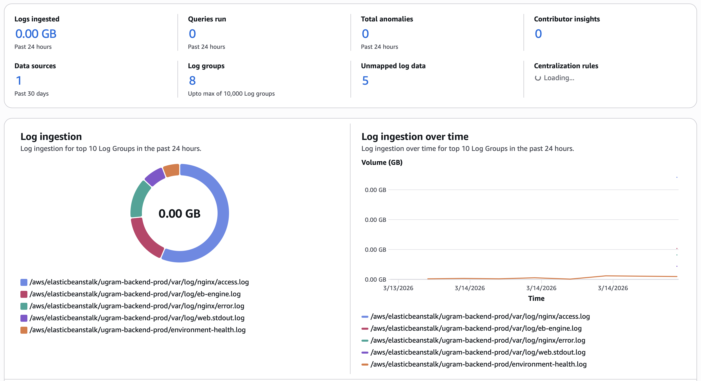
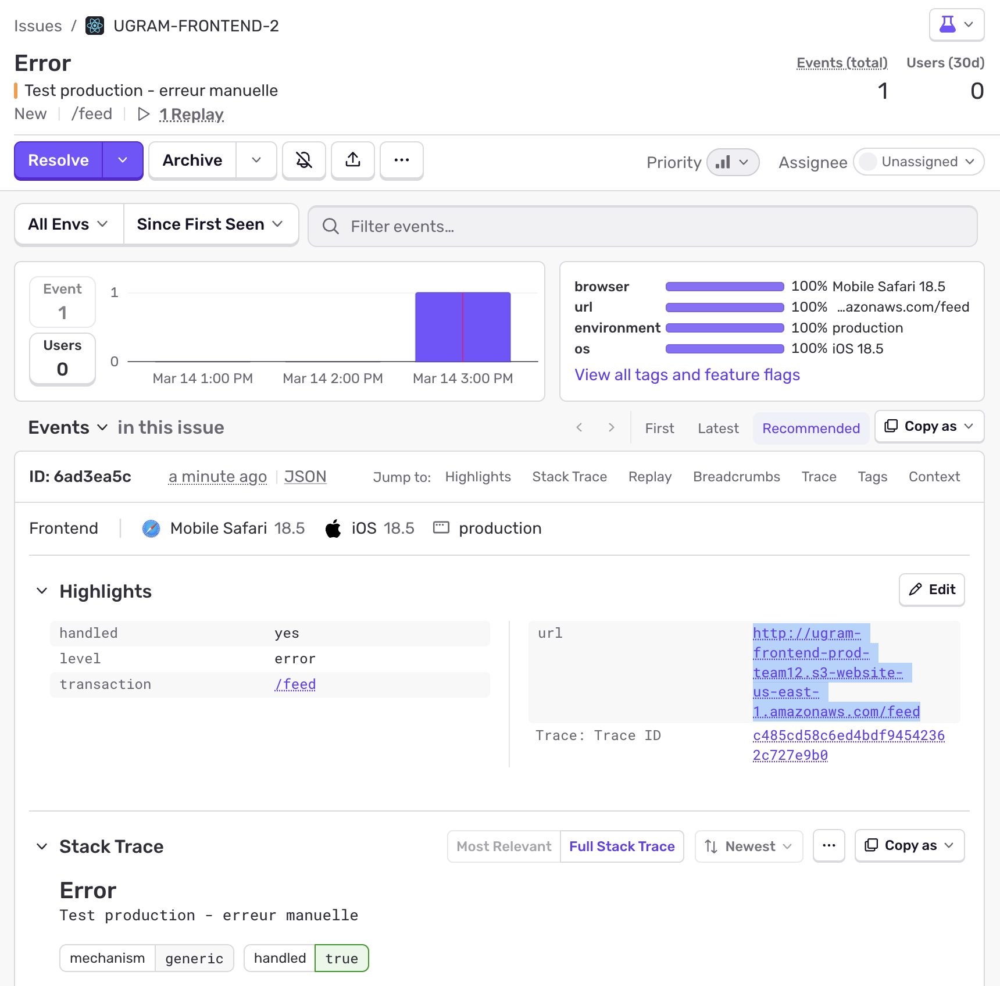

# Ugram - Application de partage d'images

Application web de type Instagram permettant aux utilisateurs de partager des images avec des descriptions, des hashtags et des mentions.

## Architecture

Le projet est organisé en monorepo avec deux parties principales :

* **Frontend** : Application React en TypeScript
* **Backend** : API REST NestJS avec base de données PostgreSQL

## Application en production

**URL de l'application**: http://ugram-frontend-prod-team12.s3-website-us-east-1.amazonaws.com

L'application est déployée sur AWS avec l'architecture suivante:
- **Frontend**: S3 Static Website Hosting
- **Backend**: Elastic Beanstalk (Node.js)
- **Base de données**: RDS PostgreSQL
- **Stockage images**: S3

Pour les détails complets de l'infrastructure (RDS, Elastic Beanstalk, S3, CloudWatch, variables d'environnement), consultez **[docs/DEPLOYMENT.md](./docs/DEPLOYMENT.md)**.

## Logging & Monitoring

L'application utilise plusieurs systèmes de logging et monitoring pour assurer la fiabilité et faciliter le débogage:

### Logging Serveur (CloudWatch)

Elastic Beanstalk stream automatiquement tous les logs vers CloudWatch avec une rétention de 7 jours:

- **Logs applicatifs** → `/var/log/web.stdout.log` (NestJS stdout/stderr)
- **Logs nginx access** → `/var/log/nginx/access.log` (requêtes HTTP)
- **Logs nginx error** → `/var/log/nginx/error.log` (erreurs serveur)
- **Logs déploiement** → `/var/log/eb-engine.log` (déploiements EB)
- **Health monitoring** → `/environment-health.log` (santé de l'environnement)

Configuration: Instance log streaming activé, rétention 7 jours, logs supprimés à la terminaison de l'environnement.

**CloudWatch Log Groups:**



Le dashboard CloudWatch permet de:
- Voir tous les log groups de l'environnement Elastic Beanstalk
- Consulter les logs en temps réel avec log streaming
- Rechercher dans les logs avec CloudWatch Logs Insights
- Configurer des alertes basées sur les logs
- Analyser les patterns d'erreurs et de requêtes

### Logging Client (Sentry)

L'application frontend utilise **Sentry** pour le suivi des erreurs côté client. Toutes les erreurs sont automatiquement capturées et envoyées à Sentry avec leur contexte d'exécution.

**Erreurs capturées:**
- Erreurs React (via ErrorBoundary)
- Erreurs globales (window.onerror)
- Erreurs API avec contexte (URL, méthode, status HTTP)
- console.error
- Promises rejetées

**Dashboard Sentry:**



Le dashboard Sentry permet de:
- Voir les erreurs en temps réel
- Analyser les stack traces
- Filtrer par environnement (production/development)
- Voir les replays de session pour les erreurs
- Suivre la performance de l'application

## CI/CD - Déploiement Continu

L'application utilise **GitHub Actions** pour l'intégration et le déploiement continu.

### Intégration Continue (CI)

**Déclenché sur:** Push sur `main` et toutes les Pull Requests

**Pipeline CI:**
1. **Build** - Compile Frontend + Backend
2. **Unit Tests** - Exécute les tests unitaires
3. **Summary** - Génère un résumé du pipeline

Les PRs ne peuvent pas être mergées si le CI échoue.

### Déploiement Continu (CD)

**Déclenché sur:** Push sur `main` uniquement

**Pipeline CD:**
1. **Deploy Frontend** → S3 Static Website (~1-2 min)
2. **Deploy Backend** → Elastic Beanstalk (~5-10 min)
3. **Deployment Summary** → Résumé avec URLs de production

**Processus:**
```bash
# 1. Développer sur une branche feature
git checkout -b feature/ma-fonctionnalite
git commit -m "feat: nouvelle fonctionnalité"
git push origin feature/ma-fonctionnalite

# 2. Créer une Pull Request
# → Le CI s'exécute automatiquement

# 3. Merger dans main après approbation
# → Le CD déploie automatiquement en production
```

**Rollback:** En cas de problème, revert le commit et push sur `main` - le CD redéploie automatiquement la version précédente.

**Documentation complète:** Voir [docs/DEPLOYMENT.md](./docs/DEPLOYMENT.md#cicd---déploiement-continu) pour les détails (configuration, secrets GitHub, monitoring, etc.)

## Prérequis

* Node.js >= 20.x
* npm >= 9.x
* PostgreSQL >= 14.x (ou Docker pour lancer la base de données)
* Docker et Docker Compose

## Installation

### 1. Cloner le dépôt

```bash
git clone <url-du-repo>
cd ugram-h2026-team-12
```

### 2. Configuration du backend

```bash
cd backend
npm install
```

### 3. Configuration du frontend

```bash
cd ../Frontend
npm install
```

## Lancement de l'application

### Option 1 : Lancement manuel

#### 1. Démarrer la base de données PostgreSQL

```bash
cd backend
docker compose up -d
```

Cela démarre un conteneur PostgreSQL sur le port 5433.

#### 2. Démarrer le backend

```bash
cd backend
npm run start:dev
```

Le backend sera accessible sur `http://localhost:8080`.

#### 3. Démarrer le frontend

```bash
cd Frontend
npm start
```

Le frontend sera accessible sur `http://localhost:3000`.

### Option 2 : Avec Docker Compose

```bash
docker compose up --build
```

## Scripts disponibles

### Backend

```bash
npm run start          # Démarrer en mode production
npm run start:dev      # Démarrer en mode développement (watch)
npm run start:debug    # Démarrer en mode debug
npm run build          # Build de production
npm run test           # Lancer les tests
npm run test:cov       # Tests avec couverture
npm run test:e2e       # Tests end-to-end
npm run format         # Formater le code avec Prettier
npm run lint           # Linter avec ESLint
```

### Frontend

```bash
npm start              # Démarrer en mode développement
npm run build          # Build de production
npm test               # Lancer les tests
npm run test:cov       # Tests avec couverture
npm run format         # Formater le code avec Prettier
npm run lint           # Linter avec ESLint
```

## Structure du projet

```
ugram-h2026-team-12/
├── backend/                    # API NestJS
│   ├── src/
│   │   ├── auth/              # Module d'authentification (JWT)
│   │   ├── users/             # Module utilisateurs
│   │   ├── images/            # Module images/posts
│   │   ├── hashtags/          # Module hashtags
│   │   ├── mentions/          # Module mentions
│   │   ├── reactions/         # Module réactions (likes)
│   │   ├── comments/          # Module commentaires
│   │   ├── messages/          # Module messages privés
│   │   ├── notifications/     # Module notifications
│   │   ├── storage/           # Module stockage (local/S3)
│   │   └── config/            # Configuration
│   ├── uploads/               # Dossier d'uploads locaux
│   ├── docker-compose.yml     # PostgreSQL
│   └── .env.example
│
└── Frontend/                   # Application React
    ├── src/
    │   ├── components/        # Composants réutilisables
    │   │   ├── Avatar/
    │   │   ├── CommentsSection/
    │   │   ├── ConversationItem/
    │   │   ├── FormField/
    │   │   ├── ImageUpload/
    │   │   ├── LoadingSpinner/
    │   │   ├── MessageBubble/
    │   │   ├── MessageInput/
    │   │   ├── MobileNav/
    │   │   ├── PageLayout/
    │   │   ├── PostCard/
    │   │   ├── RecommendedUsers/
    │   │   ├── Sidebar/
    │   │   ├── UserCard/
    │   │   └── UserContext.tsx
    │   ├── pages/             # Pages de l'application
    │   │   ├── ChatPage/
    │   │   ├── CreatePostPage/
    │   │   ├── EditPostPage/
    │   │   ├── HomePage/
    │   │   ├── LoginPage/
    │   │   ├── MessagesPage/
    │   │   ├── PostDetailPage/
    │   │   ├── ProfilePage/
    │   │   ├── SettingsPage/
    │   │   ├── SignupPage/
    │   │   └── UsersPage/
    │   ├── services/          # Services API
    │   │   ├── authService.ts
    │   │   ├── messagesService.ts
    │   │   ├── postsService.ts
    │   │   └── usersService.ts
    │   ├── types/             # Types TypeScript
    │   │   └── api.types.ts
    │   └── utils/             # Utilitaires
    │       ├── SvgFile.tsx
    │       └── validationSchemas.ts
    └── .env
```

## Fonctionnalités

### Authentification

* Inscription avec validation (email, username unique, mot de passe)
* Connexion avec JWT
* Routes protégées

### Gestion des utilisateurs

* Profil utilisateur (photo, nom, email, téléphone, date d'inscription)
* Édition du profil
* Upload d'une photo de profil
* Liste des utilisateurs avec recherche (nom, username, email)
* Profil public d'un utilisateur

### Gestion des images

* Publication d'images avec description
* Ajout de hashtags (#tag)
* Mention d'utilisateurs (@username avec résolution UUID)
* Modification d'une image (description et hashtags uniquement pour le propriétaire)
* Suppression d'une image (propriétaire uniquement)
* Feed global des images triées par date
* Grille d'images par utilisateur
* Page de détail d'une image
* Réactions (likes) sur les images
* Commentaires sur les images

### Messages privés

* Liste des conversations avec aperçu du dernier message
* Fil de discussion en temps réel
* Envoi de messages entre utilisateurs
* Indicateur de messages non lus
* Bouton "Message" sur les profils

### Recommandations de comptes

* Section "Suggested for you" dans la sidebar (desktop)
* Affichage horizontal scrollable sur mobile
* Top 5 comptes les plus populaires (basé sur likes + commentaires + posts)
* Navigation directe vers le profil

### Notifications

* Page de notifications accessible via la sidebar (desktop) et la nav mobile
* Badge rouge sur l'icône cloche indiquant le nombre de notifications non lues (rafraîchissement toutes les 30s)
* Liste des notifications avec avatar, type d'action (like / commentaire / message), nom d'utilisateur et date relative
* Marquer une notification comme lue au clic (redirige vers le post ou la conversation)
* Bouton "Mark all as read" pour tout marquer d'un coup

### Filtres photo

* Interface de sélection de filtres lors de la création d'un post
* Aperçu en temps réel avec le filtre appliqué
* 9 filtres disponibles : Normal, B&W, Sepia, Contrast, Bright, Vivid, Warm, Cool, Vintage
* Application du filtre à l'image via Canvas API avant envoi au backend

### Fonctions de recherches

* L'usager peut rechercher un autre usager via la page users.
* L'usager peut rechercher des images contenant un mot précis dans leur description.
* L'usager peut rechercher des images contenant un mot clé (hashtag) précis (en utilisant '#' dans sa recherche).

### Validation & UX

* Validation côté client (Yup) et serveur (class-validator)
* Messages d'erreur clairs avec react-toastify
* États de chargement
* Gestion des erreurs API (400, 401, 403, 404, 500)

## Technologies utilisées

### Frontend

* **React 19** - Framework UI
* **TypeScript** - Typage statique
* **React Router v7** - Routing
* **Formik** - Gestion des formulaires
* **Yup** - Validation de schémas
* **Axios** - Client HTTP
* **React Toastify** - Notifications
* **Sentry** - Error tracking et monitoring
* **CSS** - Styling (sans framework)

### Backend

* **NestJS** - Framework Node.js
* **TypeScript** - Typage statique
* **TypeORM** - ORM pour PostgreSQL
* **PostgreSQL** - Base de données
* **JWT** - Authentification
* **Passport** - Stratégies d'authentification
* **class-validator** - Validation des DTO
* **Multer** - Upload de fichiers
* **AWS SDK** - Support S3 (optionnel)

## API Endpoints

### Authentification

* `POST /api/auth/register` - Inscription
* `POST /api/auth/login` - Connexion

### Utilisateurs

* `GET /api/users` - Liste des utilisateurs (avec pagination)
* `GET /api/users/:id` - Profil utilisateur
* `PATCH /api/users/:id` - Mise à jour du profil
* `POST /api/users/:id/profile-picture` - Upload de la photo de profil

### Images

* `GET /api/images` - Liste des images (feed)
* `GET /api/images/:id` - Détail d'une image
* `POST /api/images` - Upload d'une image
* `PATCH /api/images/:id` - Mise à jour d'une image
* `DELETE /api/images/:id` - Suppression d'une image

### Réactions

* `POST /api/images/:id/reactions` - Ajouter une réaction
* `DELETE /api/images/:id/reactions` - Retirer une réaction
* `GET /api/images/:id/reactions` - Liste des réactions

### Commentaires

* `POST /api/images/:id/comments` - Ajouter un commentaire
* `DELETE /api/images/:id/comments/:commentId` - Supprimer un commentaire
* `GET /api/images/:id/comments` - Liste des commentaires

### Messages

* `POST /api/messages` - Envoyer un message
* `GET /api/messages/conversations` - Liste des conversations
* `GET /api/messages/:userId` - Messages avec un utilisateur
* `PATCH /api/messages/:id/read` - Marquer comme lu

### Notifications

* `GET /api/notifications` - Liste des notifications (paginée)
* `PATCH /api/notifications/:id/read` - Marquer une notification comme lue
* `PATCH /api/notifications/read-all` - Marquer toutes les notifications comme lues

### Recommandations

* `GET /api/users/recommended` - Comptes populaires recommandés

## Développement

### Formatage du code

Le projet utilise Prettier et ESLint pour maintenir la qualité du code.

```bash
# Backend
cd backend
npm run format
npm run lint

# Frontend
cd Frontend
npm run format
npm run lint
```

### Tests

```bash
# Backend
cd backend
npm test              # Tests unitaires
npm run test:cov      # Avec couverture
npm run test:e2e      # Tests E2E

# Frontend
cd Frontend
npm test              # Tests unitaires
npm run test:cov      # Avec couverture
```

## Équipe

GLO3112 - Développement Web (H2026)
Team 12
